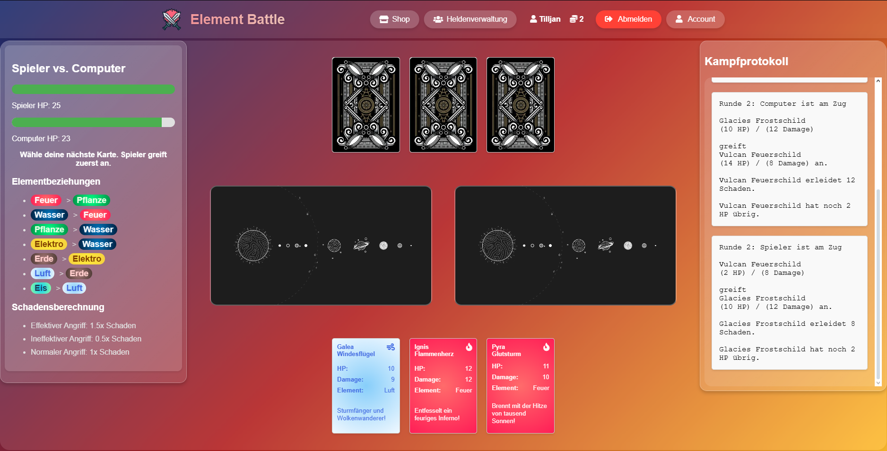

# 🌩️ Element Battle – Das ultimative Duell der Elemente

Willkommen bei **Element Battle**, einem taktischen Kartenspiel, bei dem du mit selbst gestalteten Karten gegen eine KI antrittst. Kämpfe mit Feuer, Wasser, Eis, Elektro und weiteren Elementen, um deinem Gegner die HP zu rauben – Runde für Runde, Karte für Karte.

---

## 🎮 Features

- 🔐 **Registrierung & Login**
- 🧝 **Helden-Erstellung** – designe deinen eigenen Charakter
- 🃏 **5-Karten-Deck** pro Runde
- 🌪️ **Element-System** mit Stärken und Schwächen:
  - ⚡ Elektro
  - 💧 Wasser
  - ❄️ Eis
  - 🔥 Feuer  
  *...und mehr – die komplette Übersicht findest du im Spiel!*
- 💥 **Schadensberechnung mit Strategie**
  - Angriff & HP jeder Karte: **0–15**
  - Schaden zählt **nur**, wenn Angriff > HP der gegnerischen Karte
  - Überschüssiger Schaden geht auf die **Spieler-HP (Start: 25)**
  - Karten werden **nur einmal verwendet**
- 🛠️ **Eigene Karten erstellen** – wähle Werte & Element
- 🎨 **Shop für Custom-Designs** (Hintergründe, Kartendesigns)

---

## ⚔️ Spielprinzip

1. Beide Spieler (du & die KI) bekommen 5 zufällige Karten.
2. Ihr spielt abwechselnd eine Karte pro Runde.
3. Die Kartenwerte + Elementstärken bestimmen den Schaden.
4. Schaden geht erst an die Karte, dann evtl. direkt auf die HP des Spielers.
5. Wer zuerst **0 HP** erreicht, verliert.
6. Gespielte Karten kommen **nicht zurück** – also überleg gut!

---

## 🖥️ Spielvoraussetzungen & Installation

```
git clone https://github.com/haragucci/element-battle.git
cd element-battle
```

> Starte dein Spiel lokal z. B. mit IntelliJ und dem Built-in Tomcat Server:  

---

## 🖼️ Vorschau

> 

---

## 🔮 Beispiel-Karten (Standard)

| Name         | Angriff | HP  | Element     |
|--------------|---------|-----|-------------|
| Blitzfuchs   | 12      | 4   | Elektro ⚡    |
| Eisdrache    | 8       | 10  | Eis ❄️        |
| Flammenwolf  | 15      | 2   | Feuer 🔥     |


---

## 👩‍💻 Entwickler

**Tilljan** – 17 Jahre jung, mit Leidenschaft für Webentwicklung, Design und coole Games.  
Dieses Spiel ist ein Herzensprojekt – Feedback ist willkommen! ✨

---

## 📬 Kontakt

📦 GitHub: [@Haragucci](https://github.com/Haragucci)

---

⭐ **Starte dein Elementen-Duell jetzt – und werde zum Meister von Feuer, Wasser & Blitz!**
